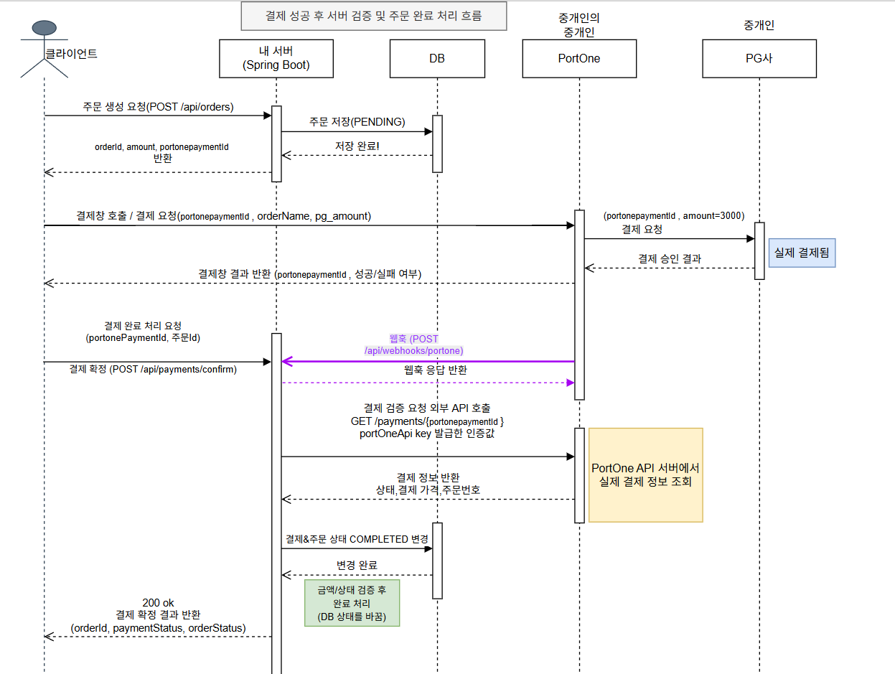
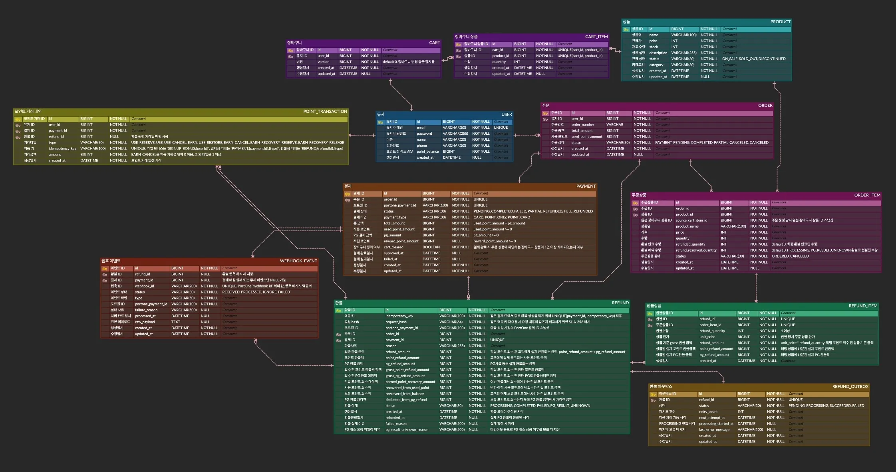
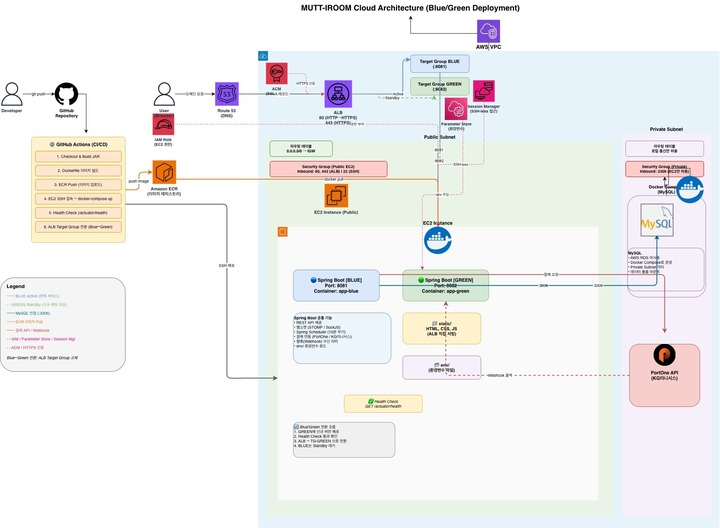

# EC2 Payment System

결제 시스템을 직접 설계하고 구현하며 백엔드 개발의 핵심을 경험한 프로젝트입니다.

주문·결제·포인트·환불이 이어지는 흐름 속에서 재고 정합성과 멱등 처리라는 실무적 과제를 스스로 정의하고 해결했습니다.
PortOne 연동을 통해 외부 PG와의 통신 구조를 이해하고, 웹훅과 클라이언트 응답이 경쟁하는 상황을 안전하게 처리하는 방법을 구현했습니다.

## 팀원 역할


## 주요 기능

- 회원/인증: 회원가입, 로그인, JWT 인증, 사용자별 리소스 소유권 검증
- 상품/장바구니/주문: 상품 조회, 장바구니 관리, 주문 생성, 재고 선차감
- 결제: PortOne 카드 결제, 포인트 전액 결제, 카드/포인트 복합 결제, 결제 확정 및 웹훅 멱등 처리
- 포인트: 회원가입 포인트 지급, 결제 금액 기준 적립, 사용 예약/확정/복구 원장 관리
- 환불: 전체/부분 환불, PG/포인트 분리 정산, 적립 포인트 회수, Outbox 기반 재시도

## 핵심 설계 포인트

- 클라이언트 결제 성공 응답만 신뢰하지 않고, 서버가 PortOne 결제 정보를 재조회한 뒤 주문/결제 상태를 변경합니다.
- 결제 확정 API와 웹훅은 쓰기 잠금과 완료 상태 재응답으로 중복/역순 요청에도 멱등하게 처리합니다.
- 주문 생성 시 재고를 먼저 차감하고, 결제 전 취소나 환불 시 재고와 포인트를 복구합니다.
- 포인트는 회원 잔액과 거래 원장을 함께 관리해 적립, 예약, 확정, 복구 이력을 추적합니다.
- 복합 결제 환불은 PG 취소 금액, 사용 포인트 복구 금액, 적립 포인트 회수 금액을 분리해 계산합니다.
- PortOne 환불 결과가 불명확하거나 실패하면 Outbox와 스케줄러로 재시도 대상을 관리합니다.

## 결제 시퀀스 다이어그램



결제 확정 API와 웹훅이 어떤 순서로 도착해도 서버가 PortOne 결제 정보를 재조회한 뒤 같은 최종 상태로 처리합니다.

## ERD



- [ERD 문서](./docs/ERD.md)

## 인프라 구성



GitHub Actions에서 빌드와 테스트를 수행하고 Docker 이미지를 Amazon ECR에 push합니다. 배포 시에는 비활성 EC2 컨테이너를 먼저 갱신한 뒤, 헬스 체크 성공 시 ALB Target Group을 전환하는 Blue-Green 구조를 사용합니다.

## 배포 주소

- [https://eungilab.dev/](https://eungilab.dev/)

## 기술 스택

### Backend


### Database / Infra


## 프로젝트 구조

```text
domain  - auth, cart, order, payment, point, product, refund, user
global  - config, exception, pagination, response, security
infra   - PortOne 연동
```

## API 명세서

- API 명세는 [API 명세서](./docs/api/README.md)에 적혀있습니다.

## 로컬 실행 방법

`.env.example`을 복사해 `.env`를 만들고 필요한 값을 채운 뒤, MySQL에 `ec2_payment_system` 데이터베이스를 생성합니다.

Windows PowerShell:

```powershell
Copy-Item .env.example .env
.\gradlew.bat bootRun
```

macOS/Linux:

```bash
cp .env.example .env
./gradlew bootRun
```

실행 후 다음 정적 화면을 확인할 수 있습니다.

- `http://localhost:8080`
- `http://localhost:8080/payment.html`
- `http://localhost:8080/orders.html`
- `http://localhost:8080/refund.html`

## 테스트

macOS/Linux:

```bash
./gradlew test
```

Windows PowerShell:

```powershell
.\gradlew.bat test
```

주요 테스트 관점은 주문 생성 시 재고 차감, 결제 확정과 웹훅의 멱등성, 포인트 원장 정합성, 복합 결제 부분 환불 계산, 환불 실패/불명확 상태 재시도 처리입니다.

## 향후 개선 사항

- 멤버십 등급 및 구독 결제 확장
- 결제 실패 상태 세분화
- 결제/환불 관리자 화면 추가
- 운영 모니터링 및 알림 고도화
