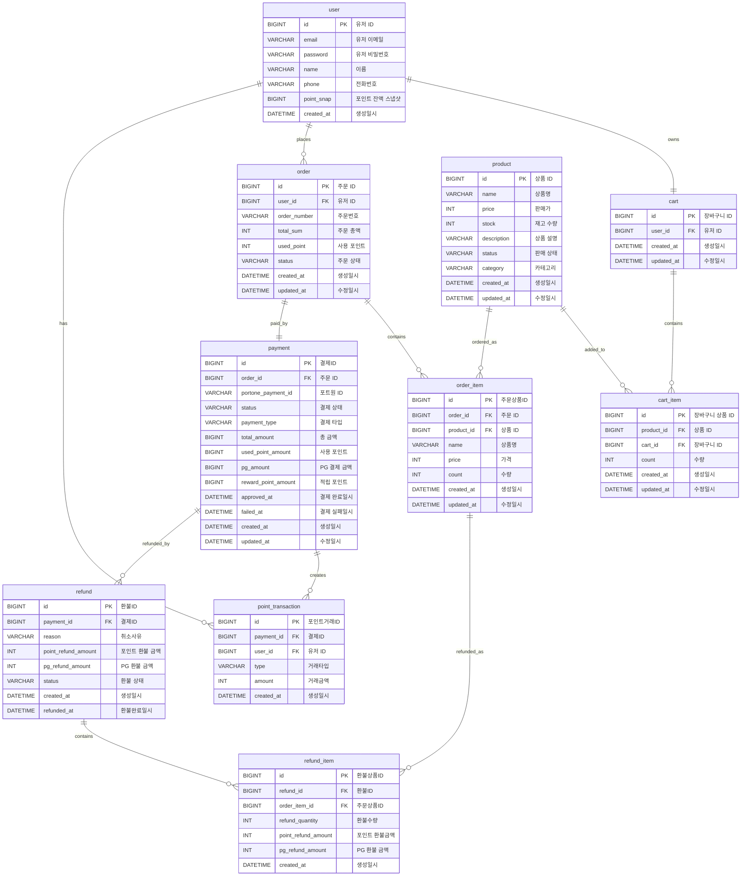

# ERD

결제 시스템의 ERD를 이미지 기준으로 정리한 문서입니다.

## 관계도

## 테이블 정의

### user

| 논리명 | 컬럼명 | 타입 | NULL | 제약/비고 |
| --- | --- | --- | --- | --- |
| 유저 ID | id | BIGINT | NOT NULL | PK |
| 유저 이메일 | email | VARCHAR(50) | NOT NULL |  |
| 유저 비밀번호 | password | VARCHAR(255) | NOT NULL |  |
| 이름 | name | VARCHAR(20) | NOT NULL |  |
| 전화번호 | phone | VARCHAR(50) | NOT NULL |  |
| 포인트 잔액 스냅샷 | point_snap | BIGINT | NOT NULL |  |
| 생성일시 | created_at | DATETIME | NULL |  |

### cart

| 논리명 | 컬럼명 | 타입 | NULL | 제약/비고 |
| --- | --- | --- | --- | --- |
| 장바구니 ID | id | BIGINT | NOT NULL | PK |
| 유저 ID | user_id | BIGINT | NOT NULL | FK: user.id |
| 생성일시 | created_at | DATETIME | NOT NULL |  |
| 수정일시 | updated_at | DATETIME | NULL |  |

### cart_item

| 논리명 | 컬럼명 | 타입 | NULL | 제약/비고 |
| --- | --- | --- | --- | --- |
| 장바구니 상품 ID | id | BIGINT | NOT NULL | PK |
| 상품 ID | product_id | BIGINT | NOT NULL | FK: product.id, UNIQUE |
| 장바구니 ID | cart_id | BIGINT | NOT NULL | FK: cart.id, UNIQUE |
| 수량 | count | INT | NOT NULL |  |
| 생성일시 | created_at | DATETIME | NOT NULL |  |
| 수정일시 | updated_at | DATETIME | NULL |  |

### product

| 논리명 | 컬럼명 | 타입 | NULL | 제약/비고 |
| --- | --- | --- | --- | --- |
| 상품 ID | id | BIGINT | NOT NULL | PK |
| 상품명 | name | VARCHAR(100) | NOT NULL |  |
| 판매가 | price | INT | NOT NULL |  |
| 재고 수량 | stock | INT | NOT NULL |  |
| 상품 설명 | description | VARCHAR(255) | NOT NULL |  |
| 판매 상태 | status | VARCHAR(30) | NOT NULL | ON_SALE, SOLD_OUT, DISCONTINUED |
| 카테고리 | category | VARCHAR(30) | NOT NULL |  |
| 생성일시 | created_at | DATETIME | NOT NULL |  |
| 수정일시 | updated_at | DATETIME | NULL |  |

### order

| 논리명 | 컬럼명 | 타입 | NULL | 제약/비고 |
| --- | --- | --- | --- | --- |
| 주문 ID | id | BIGINT | NOT NULL | PK |
| 유저 ID | user_id | BIGINT | NOT NULL | FK: user.id |
| 주문번호 | order_number | VARCHAR | NOT NULL |  |
| 주문 총액 | total_sum | INT | NOT NULL |  |
| 사용 포인트 | used_point | INT | NOT NULL |  |
| 주문 상태 | status | VARCHAR | NOT NULL | PAYMENT_PENDING, COMPLETED, CANCELED |
| 생성일시 | created_at | DATETIME | NOT NULL |  |
| 수정일시 | updated_at | DATETIME | NULL |  |

### order_item

| 논리명 | 컬럼명 | 타입 | NULL | 제약/비고 |
| --- | --- | --- | --- | --- |
| 주문상품ID | id | BIGINT | NOT NULL | PK |
| 주문 ID | order_id | BIGINT | NOT NULL | FK: order.id |
| 상품 ID | product_id | BIGINT | NOT NULL | FK: product.id |
| 상품명 | name | VARCHAR(100) | NOT NULL |  |
| 가격 | price | INT | NOT NULL |  |
| 수량 | count | INT | NOT NULL |  |
| 생성일시 | created_at | DATETIME | NOT NULL |  |
| 수정일시 | updated_at | DATETIME | NULL |  |

### payment

| 논리명 | 컬럼명 | 타입 | NULL | 제약/비고 |
| --- | --- | --- | --- | --- |
| 결제ID | id | BIGINT | NOT NULL | PK |
| 주문 ID | order_id | BIGINT | NOT NULL | FK: order.id, UNIQUE |
| 포트원 ID | portone_payment_id | VARCHAR(100) | NOT NULL | UNIQUE |
| 결제 상태 | status | VARCHAR(30) | NOT NULL | PENDING, COMPLETED, FAILED, PARTIAL_REFUNDED, REFUNDED |
| 결제 타입 | payment_type | VARCHAR(30) | NOT NULL | CARD, POINT_ONLY, POINT_CARD |
| 총 금액 | total_amount | BIGINT | NOT NULL | used_point + pg_amount |
| 사용 포인트 | used_point_amount | BIGINT | NOT NULL | used_point_amount >= 0 |
| PG 결제 금액 | pg_amount | BIGINT | NOT NULL | pg_amount >= 0 |
| 적립 포인트 | reward_point_amount | BIGINT | NULL | reward_point_amount >= 0 |
| 결제 완료일시 | approved_at | DATETIME | NULL |  |
| 결제 실패일시 | failed_at | DATETIME | NULL |  |
| 생성일시 | created_at | DATETIME | NOT NULL |  |
| 수정일시 | updated_at | DATETIME | NOT NULL |  |

### point_transaction

| 논리명 | 컬럼명 | 타입 | NULL | 제약/비고 |
| --- | --- | --- | --- | --- |
| 포인트거래ID | id | BIGINT | NOT NULL | PK |
| 결제ID | payment_id | BIGINT | NOT NULL | FK: payment.id |
| 유저 ID | user_id | BIGINT | NOT NULL | FK: user.id |
| 거래타입 | type | VARCHAR | NOT NULL | USE, EARN, USE_RESTORE, EARN_CANCEL |
| 거래금액 | amount | INT | NOT NULL |  |
| 생성일시 | created_at | DATETIME | NOT NULL | 포인트 거래 발생 시각 |

### refund

| 논리명 | 컬럼명 | 타입 | NULL | 제약/비고 |
| --- | --- | --- | --- | --- |
| 환불ID | id | BIGINT | NOT NULL | PK |
| 결제ID | payment_id | BIGINT | NOT NULL | FK: payment.id |
| 취소사유 | reason | VARCHAR(255) | NOT NULL |  |
| 포인트 환불 금액 | point_refund_amount | INT | NOT NULL |  |
| PG 환불 금액 | pg_refund_amount | INT | NOT NULL |  |
| 환불 상태 | status | VARCHAR(30) | NOT NULL | COMPLETED, FAILED |
| 생성일시 | created_at | DATETIME | NOT NULL | 환불 요청이 생성된 시각 |
| 환불완료일시 | refunded_at | DATETIME | NOT NULL | 실제 PG 환불이 완료된 시각 |

### refund_item

| 논리명 | 컬럼명 | 타입 | NULL | 제약/비고 |
| --- | --- | --- | --- | --- |
| 환불상품ID | id | BIGINT | NOT NULL | PK |
| 환불ID | refund_id | BIGINT | NOT NULL | FK: refund.id |
| 주문상품ID | order_item_id | BIGINT | NOT NULL | FK: order_item.id |
| 환불수량 | refund_quantity | INT | NOT NULL |  |
| 포인트 환불금액 | point_refund_amount | INT | NOT NULL |  |
| PG 환불 금액 | pg_refund_amount | INT | NOT NULL |  |
| 생성일시 | created_at | DATETIME | NOT NULL |  |

## 관계 요약

| 관계 | 설명 |
| --- | --- |
| user - cart | 유저는 장바구니를 가진다. |
| user - order | 유저는 여러 주문을 생성할 수 있다. |
| user - point_transaction | 유저는 여러 포인트 거래 내역을 가진다. |
| cart - cart_item | 장바구니는 여러 장바구니 상품을 담는다. |
| product - cart_item | 상품은 장바구니 상품으로 담길 수 있다. |
| order - order_item | 주문은 여러 주문 상품을 가진다. |
| product - order_item | 상품은 주문 상품으로 기록된다. |
| order - payment | 주문은 결제와 1:1로 연결된다. |
| payment - point_transaction | 결제는 포인트 거래 내역을 생성할 수 있다. |
| payment - refund | 결제는 여러 환불 내역을 가질 수 있다. |
| refund - refund_item | 환불은 여러 환불 상품을 가진다. |
| order_item - refund_item | 주문 상품은 환불 상품으로 참조된다. |
