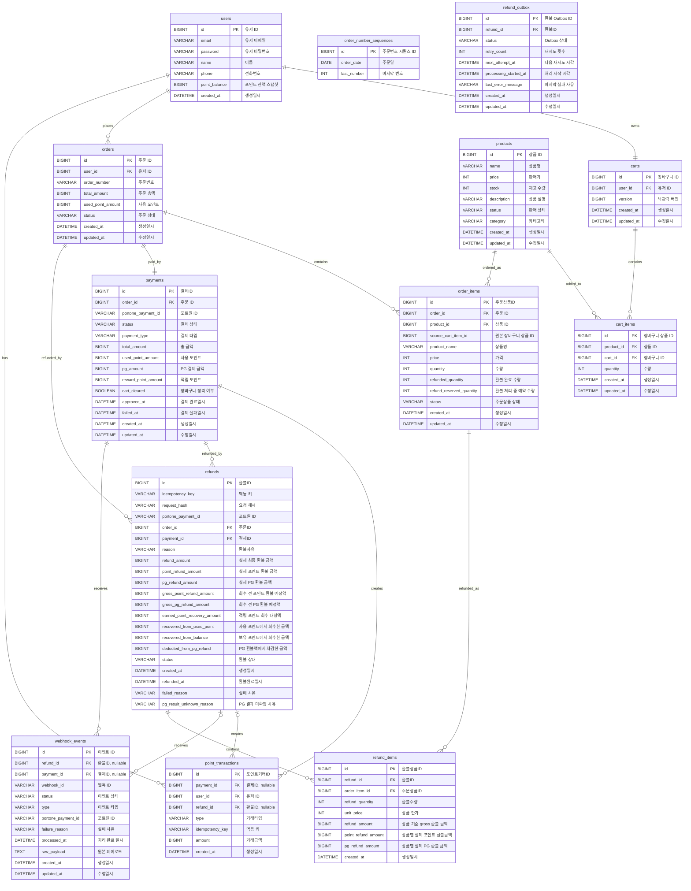

# ERD

## Refund Settlement Columns

`refunds`는 `request_hash`, `gross_point_refund_amount`, `gross_pg_refund_amount`,
`earned_point_recovery_amount`, `recovered_from_used_point`, `recovered_from_balance`,
`deducted_from_pg_refund` 컬럼을 함께 저장합니다.

회원가입 포인트 거래 타입은 `SIGNUP_BONUS`입니다.
환불 관련 포인트 거래 타입은 `USE_RESTORE`, `EARN_CANCEL`,
`EARN_RECOVERY_RESERVE`, `EARN_RECOVERY_RELEASE`를 포함합니다.

결제 시스템의 ERD를 이미지 기준으로 정리한 문서입니다.

## 관계도

## 테이블 정의

### users

| 논리명 | 컬럼명 | 타입 | NULL | 제약/비고  |
| --- | --- | --- | --- |--------|
| 유저 ID | id            | BIGINT | NOT NULL | PK     |
| 유저 이메일 | email         | VARCHAR(50) | NOT NULL | UNIQUE |
| 유저 비밀번호 | password      | VARCHAR(255) | NOT NULL |        |
| 이름 | name          | VARCHAR(20) | NOT NULL |        |
| 전화번호 | phone         | VARCHAR(50) | NOT NULL |        |
| 포인트 잔액 스냅샷 | point_balance | BIGINT | NOT NULL |        |
| 생성일시 | created_at    | DATETIME | NULL |        |

### carts

| 논리명 | 컬럼명 | 타입 | NULL | 제약/비고 |
| --- | --- | --- | --- | --- |
| 장바구니 ID | id | BIGINT | NOT NULL | PK |
| 유저 ID | user_id | BIGINT | NOT NULL | FK: users.id |
| 낙관락 버전 | version | BIGINT | NOT NULL | 장바구니 변경 충돌 감지용 |
| 생성일시 | created_at | DATETIME | NOT NULL |  |
| 수정일시 | updated_at | DATETIME | NULL |  |

### cart_items

| 논리명 | 컬럼명 | 타입 | NULL | 제약/비고 |
| --- | --- | --- | --- | --- |
| 장바구니 상품 ID | id | BIGINT | NOT NULL | PK |
| 상품 ID | product_id | BIGINT | NOT NULL | FK: products.id, UNIQUE(cart_id, product_id) |
| 장바구니 ID | cart_id | BIGINT | NOT NULL | FK: carts.id, UNIQUE(cart_id, product_id) |
| 수량 | quantity | INT | NOT NULL |  |
| 생성일시 | created_at | DATETIME | NOT NULL |  |
| 수정일시 | updated_at | DATETIME | NULL |  |

한 장바구니에는 같은 상품이 한 줄만 존재합니다. 같은 상품을 다시 담으면 새 row를 만들지 않고 기존 `cart_items.quantity`를 합산합니다.
결제 완료 시에는 주문에 포함된 `cart_items`만 삭제되며, 같은 장바구니에 남아 있는 미주문 상품 row는 유지됩니다.

### products

| 논리명 | 컬럼명 | 타입 | NULL | 제약/비고 |
| --- | --- | --- | --- | --- |
| 상품 ID | id | BIGINT | NOT NULL | PK |
| 상품명 | name | VARCHAR(100) | NOT NULL |  |
| 판매가 | price | INT | NOT NULL |  |
| 재고 수량 | stock | INT | NOT NULL |  |
| 상품 설명 | description | VARCHAR(255) | NOT NULL |  |
| 판매 상태 | status | VARCHAR(30) | NOT NULL | ON_SALE, SOLD_OUT, DISCONTINUED |
| 카테고리 | category | VARCHAR(30) | NOT NULL |  |
| 생성일시 | created_at | DATETIME | NOT NULL |  |
| 수정일시 | updated_at | DATETIME | NULL |  |

### orders

| 논리명 | 컬럼명 | 타입 | NULL | 제약/비고 |
| --- | --- | --- | --- | --- |
| 주문 ID | id           | BIGINT | NOT NULL | PK |
| 유저 ID | user_id      | BIGINT | NOT NULL | FK: users.id |
| 주문번호 | order_number | VARCHAR | NOT NULL |  |
| 주문 총액 | total_amount | BIGINT | NOT NULL |  |
| 사용 포인트 | used_point_amount | BIGINT | NOT NULL |  |
| 주문 상태 | status       | VARCHAR | NOT NULL | PAYMENT_PENDING, COMPLETED, PARTIAL_CANCELED, CANCELED |
| 생성일시 | created_at   | DATETIME | NOT NULL |  |
| 수정일시 | updated_at   | DATETIME | NULL |  |

### order_items

| 논리명 | 컬럼명          | 타입 | NULL | 제약/비고 |
| --- |--------------| --- | --- | --- |
| 주문상품ID | id           | BIGINT | NOT NULL | PK |
| 주문 ID | order_id     | BIGINT | NOT NULL | FK: orders.id |
| 상품 ID | product_id   | BIGINT | NOT NULL | FK: products.id |
| 원본 장바구니 상품 ID | source_cart_item_id | BIGINT | NOT NULL | 주문 생성 당시 원본 장바구니 상품 ID 스냅샷 |
| 상품명 | product_name | VARCHAR(100) | NOT NULL |  |
| 가격 | price        | INT | NOT NULL |  |
| 수량 | quantity     | INT | NOT NULL |  |
| 환불 완료 수량 | refunded_quantity | INT | NOT NULL | 기본값 0. 최종 환불 완료된 수량 |
| 환불 예약 수량 | refund_reserved_quantity | INT | NOT NULL | 기본값 0. `PROCESSING`, `PG_RESULT_UNKNOWN` 환불로 선점된 수량 |
| 주문상품 상태 | status | VARCHAR(30) | NOT NULL | ORDERED, CANCELED |
| 생성일시 | created_at   | DATETIME | NOT NULL |  |
| 수정일시 | updated_at   | DATETIME | NULL |  |

### order_number_sequences

| 논리명 | 컬럼명 | 타입 | NULL | 제약/비고 |
| --- | --- | --- | --- | --- |
| 주문번호 시퀀스 ID | id | BIGINT | NOT NULL | PK |
| 주문일 | order_date | DATE | NOT NULL | UNIQUE |
| 마지막 번호 | last_number | INT | NOT NULL | 날짜별 주문번호 증가값 |

### payments

| 논리명 | 컬럼명 | 타입 | NULL | 제약/비고 |
| --- | --- | --- | --- | --- |
| 결제ID | id | BIGINT | NOT NULL | PK |
| 주문 ID | order_id | BIGINT | NOT NULL | FK: orders.id, UNIQUE |
| 포트원 ID | portone_payment_id | VARCHAR(100) | NOT NULL | UNIQUE |
| 결제 상태 | status | VARCHAR(30) | NOT NULL | PENDING, COMPLETED, FAILED, PARTIAL_REFUNDED, FULL_REFUNDED |
| 결제 타입 | payment_type | VARCHAR(30) | NOT NULL | CARD, POINT_ONLY, POINT_CARD |
| 총 금액 | total_amount | BIGINT | NOT NULL | used_point_amount + pg_amount |
| 사용 포인트 | used_point_amount | BIGINT | NOT NULL | used_point_amount >= 0 |
| PG 결제 금액 | pg_amount | BIGINT | NOT NULL | pg_amount >= 0 |
| 적립 포인트 | reward_point_amount | BIGINT | NULL | reward_point_amount >= 0 |
| 장바구니 정리 여부 | cart_cleared | BOOLEAN | NOT NULL | 결제 완료 시 주문 상품에 해당하는 장바구니 상품이 1건 이상 삭제됐는지 여부 |
| 결제 완료일시 | approved_at | DATETIME | NULL |  |
| 결제 실패일시 | failed_at | DATETIME | NULL |  |
| 생성일시 | created_at | DATETIME | NOT NULL |  |
| 수정일시 | updated_at | DATETIME | NOT NULL |  |

### point_transactions
제약 조건:
- `UNIQUE (idempotency_key)`

| 논리명 | 컬럼명 | 타입 | NULL | 제약/비고 |
| --- | --- | --- | --- | --- |
| 포인트거래ID | id         | BIGINT | NOT NULL | PK                                  |
| 결제ID    | payment_id | BIGINT | NULL | FK: payments.id. `SIGNUP_BONUS`는 결제 없이 생성 |
| 유저 ID   | user_id    | BIGINT | NOT NULL | FK: users.id                        |
| 환불ID | refund_id | BIGINT | NULL | FK: refunds.id. `USE_RESTORE`, `EARN_CANCEL`, `EARN_RECOVERY_RESERVE`, `EARN_RECOVERY_RELEASE`인 경우 저장 |
| 거래타입    | type       | VARCHAR | NOT NULL | SIGNUP_BONUS, USE_RESERVE, USE, USE_CANCEL, EARN, USE_RESTORE, EARN_CANCEL, EARN_RECOVERY_RESERVE, EARN_RECOVERY_RELEASE |
| 멱등 키 | idempotency_key | VARCHAR | NOT NULL | UNIQUE. 가입 보너스는 `SIGNUP_BONUS:{userId}`, 결제성 거래는 `PAYMENT:{paymentId}:{type}`, 환불성 거래는 `REFUND:{refundId}:{type}` |
| 거래금액    | amount     | BIGINT | NOT NULL | `EARN_CANCEL`은 멱등 기록을 위해 0 허용, 그 외 타입은 1 이상 |
| 생성일시    | created_at | DATETIME | NOT NULL | 포인트 거래 발생 시각                        |

### refunds

| 논리명 | 컬럼명 | 타입 | NULL | 제약/비고 |
| --- | --- | --- | --- | --- |
| 환불ID | id | BIGINT | NOT NULL | PK                            |
| 멱등 키 | idempotency_key | VARCHAR(100) | NOT NULL | 같은 결제 안에서 중복 환불 생성을 막기 위해 `UNIQUE(payment_id, idempotency_key)` 적용 |
| 요청 해시 | request_hash | VARCHAR(64) | NOT NULL | 같은 `Idempotency-Key` 재요청 시 요청 내용이 같은지 비교하기 위한 SHA-256 해시 |
| 포트원 ID | portone_payment_id | VARCHAR(100) | NOT NULL | 환불 생성 시점의 `payment.portone_payment_id` 스냅샷 |
| 주문ID | order_id | BIGINT | NOT NULL | FK: orders.id                 |
| 결제ID | payment_id | BIGINT | NOT NULL | FK: payments.id               |
| 환불사유 | reason | VARCHAR(255) | NOT NULL |                               |
| 실제 최종 환불 금액 | refund_amount | BIGINT | NOT NULL | 적립 포인트 회수 후 고객에게 실제 반환되는 금액. `point_refund_amount + pg_refund_amount` |
| 실제 포인트 환불 금액 | point_refund_amount | BIGINT | NOT NULL | 고객에게 실제 복구되는 사용 포인트 금액 |
| 실제 PG 환불 금액 | pg_refund_amount | BIGINT | NOT NULL | PG사를 통해 실제 환불되는 금액 |
| 회수 전 포인트 환불 예정액 | gross_point_refund_amount | BIGINT | NOT NULL | 적립 포인트 회수 전 원래 반환 예정이던 사용 포인트 금액 |
| 회수 전 PG 환불 예정액 | gross_pg_refund_amount | BIGINT | NOT NULL | 적립 포인트 회수 전 원래 PG로 환불하려던 금액 |
| 적립 포인트 회수 대상액 | earned_point_recovery_amount | BIGINT | NOT NULL | 이번 환불에서 회수해야 하는 적립 포인트 총액 |
| 사용 포인트 회수액 | recovered_from_used_point | BIGINT | NOT NULL | 반환 예정 사용 포인트에서 회수한 적립 포인트 금액 |
| 보유 포인트 회수액 | recovered_from_balance | BIGINT | NOT NULL | 고객의 현재 보유 포인트에서 차감한 적립 포인트 금액 |
| PG 환불 차감액 | deducted_from_pg_refund | BIGINT | NOT NULL | 보유 포인트로 회수하지 못해 PG 환불 금액에서 차감한 금액 |
| 환불 상태 | status | VARCHAR(30) | NOT NULL | PROCESSING, COMPLETED, FAILED, PG_RESULT_UNKNOWN |
| 생성일시 | created_at | DATETIME | NOT NULL | 환불 요청이 생성된 시각                 |
| 환불완료일시 | refunded_at | DATETIME | NULL | 실제 PG 환불이 완료된 시각              |
| 실패 사유 | failed_reason | VARCHAR(500) | NULL | 실패 확정 시 저장 |
| PG 결과 미확정 사유 | pg_result_unknown_reason | VARCHAR(500) | NULL | 타임아웃 등으로 PG 취소 성공 여부를 모를 때 저장 |

### webhook_events
제약 조건:
- `UNIQUE (webhook_id)`

| 논리명 | 컬럼명 | 타입 | NULL | 제약/비고 |
| --- | --- | --- | --- | --- |
| 이벤트 ID | id | BIGINT | NOT NULL | PK |
| 환불ID | refund_id | BIGINT | NULL | FK: refunds.id. 환불 웹훅 처리 시 저장 |
| 결제ID | payment_id | BIGINT | NULL | FK: payments.id. 결제 매칭 실패 또는 무시 이벤트면 NULL 가능 |
| 웹훅 ID | webhook_id | VARCHAR(200) | NOT NULL | UNIQUE. PortOne `webhook-id` 헤더 값, 웹훅 메시지 멱등 키 |
| 이벤트 상태 | status | VARCHAR(30) | NOT NULL | RECEIVED, PROCESSED, IGNORE, FAILED |
| 이벤트 타입 | type | VARCHAR(50) | NOT NULL | 예: Transaction.Paid, Transaction.Failed, Transaction.Cancelled |
| 포트원 ID | portone_payment_id | VARCHAR(100) | NULL | PortOne 결제 ID. 결제 ID를 추출할 수 없는 무시 이벤트면 NULL 가능 |
| 실패 사유 | failure_reason | VARCHAR(500) | NULL | 처리 실패 또는 무시 사유 |
| 처리 완료 일시 | processed_at | DATETIME | NULL | 처리 완료 시각 |
| 원본 페이로드 | raw_payload | TEXT | NULL | 서명 검증에 사용한 원본 본문 |
| 생성일시 | created_at | DATETIME | NOT NULL | 수신 이벤트 생성 시각 |
| 수정일시 | updated_at | DATETIME | NOT NULL | 수신 이벤트 수정 시각 |

### refund_items

| 논리명 | 컬럼명 | 타입 | NULL | 제약/비고 |
| --- | --- | --- | --- | --- |
| 환불상품ID | id | BIGINT | NOT NULL | PK |
| 환불ID | refund_id | BIGINT | NOT NULL | FK: refunds.id |
| 주문상품ID | order_item_id | BIGINT | NOT NULL | FK: order_items.id |
| 환불수량 | refund_quantity | INT | NOT NULL | 1 이상 |
| 상품 단가 | unit_price | INT | NOT NULL | 환불 당시 주문 상품 단가 |
| 상품 기준 gross 환불 금액 | refund_amount | BIGINT | NOT NULL | `unit_price * refund_quantity`. 적립 포인트 회수 전 상품 기준 금액 |
| 상품별 실제 포인트 환불금액 | point_refund_amount | BIGINT | NOT NULL | 해당 상품에 배분된 실제 포인트 반환액 |
| 상품별 실제 PG 환불 금액 | pg_refund_amount | BIGINT | NOT NULL | 해당 상품에 배분된 실제 PG 환불액 |
| 생성일시 | created_at | DATETIME | NOT NULL |  |

### refund_outbox
제약 조건:
- `UNIQUE (refund_id)`

| 논리명 | 컬럼명 | 타입 | NULL | 제약/비고 |
| --- | --- | --- | --- | --- |
| 환불 Outbox ID | id | BIGINT | NOT NULL | PK |
| 환불ID | refund_id | BIGINT | NOT NULL | FK: refunds.id |
| Outbox 상태 | status | VARCHAR(30) | NOT NULL | PENDING, PROCESSING, SUCCEEDED, FAILED |
| 재시도 횟수 | retry_count | INT | NOT NULL | PG 취소 재시도 횟수 |
| 다음 재시도 시각 | next_attempt_at | DATETIME | NOT NULL | 스케줄러가 다시 처리할 수 있는 시각 |
| 처리 시작 시각 | processing_started_at | DATETIME | NULL | PROCESSING 상태 진입 시각 |
| 마지막 실패 사유 | last_error_message | VARCHAR(500) | NULL | 마지막 실패 요약 메시지 |
| 생성일시 | created_at | DATETIME | NOT NULL |  |
| 수정일시 | updated_at | DATETIME | NOT NULL |  |

## 관계 요약

| 관계 | 설명 |
| --- | --- |
| user - cart | 유저는 장바구니를 가진다. |
| user - order | 유저는 여러 주문을 생성할 수 있다. |
| user - point_transaction | 유저는 여러 포인트 거래 내역을 가진다. |
| cart - cart_item | 장바구니는 여러 장바구니 상품을 담는다. |
| product - cart_item | 상품은 장바구니 상품으로 담길 수 있다. |
| order - order_item | 주문은 여러 주문 상품을 가진다. |
| product - order_item | 상품은 주문 상품으로 기록된다. |
| order - payment | 주문은 결제와 1:1로 연결된다. |
| order - refund | 주문은 여러 환불 내역을 가질 수 있다. |
| payment - point_transaction | 결제는 포인트 거래 내역을 생성할 수 있다. |
| payment - refund | 결제는 여러 환불 내역을 가질 수 있다. |
| payment - webhook_event | 결제는 여러 웹훅 수신 이벤트와 연결될 수 있다. |
| refund - point_transaction | 환불은 사용 포인트 복구 및 적립 포인트 회수 거래 내역을 생성할 수 있다. |
| refund - webhook_event | 환불은 여러 웹훅 수신 이벤트와 연결될 수 있다. |
| refund - refund_outbox | 환불은 실제 PG 취소 처리를 위한 Outbox 작업을 1건 가질 수 있다. |
| refund - refund_item | 환불은 여러 환불 상품을 가진다. |
| order_item - refund_item | 주문 상품은 환불 상품으로 참조된다. |
